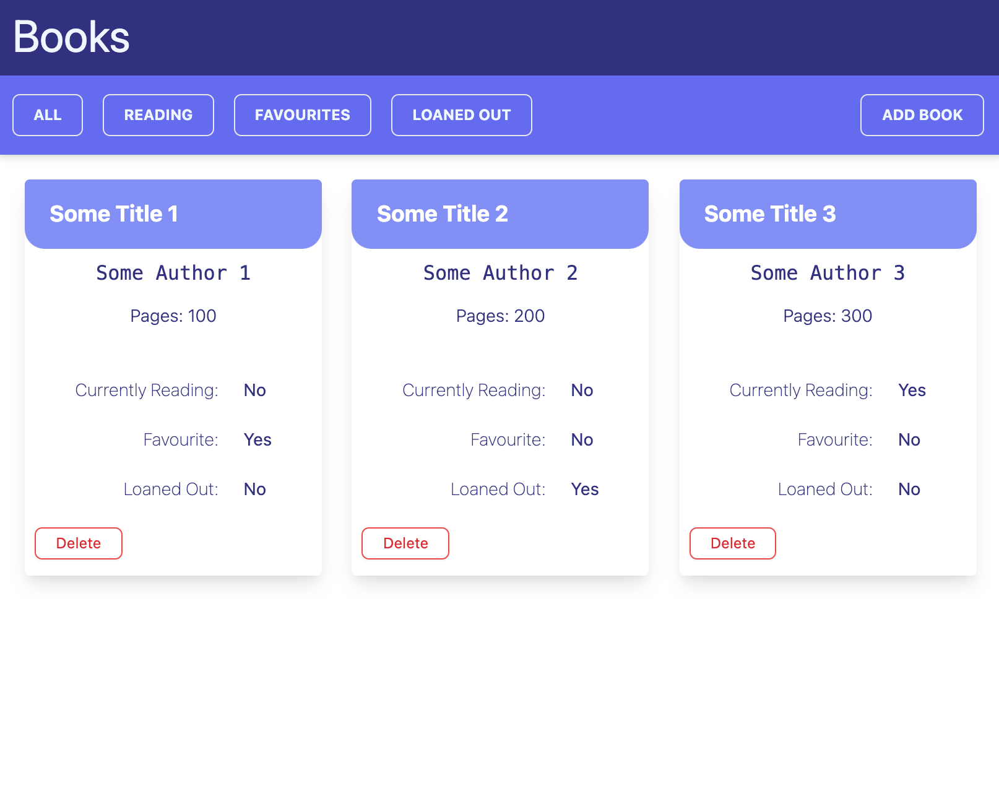
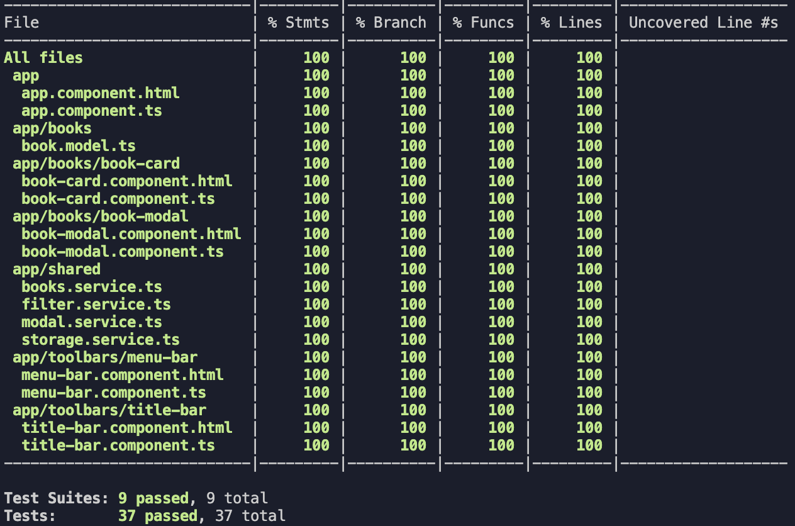

## Angular version of [Library-React-App](https://github.com/flsoller/library-react-app)

In order to compare the workflows of the two frontend technologies, this project aims to replicate the React version of the library app. [Live Reference Project](https://flsoller.github.io/library-react-app/)

The functionality will be equal, though the UI may look different.

## Preview:

## Test Coverage:

## Targets:

- [x] Define containers and components
- [x] Create tool- and navbars
- [x] Structure app component
- [x] Create book card component
- [x] Display book cards from array
- [x] Open library by view (all, loaned, reading status, favourites)
- [x] Add functionality for deleting books
- [x] Add functionality for localStorage
- [x] Achieve 100% test coverage
- [ ] Add ability to change read/fav/loaned status after creation

## Learning outcomes (compared to React):

- Angular is a framework that "comes with batteries included" which reduces dependencies on external libraries. Usually React projects will differ significantly from each other as there are different solutions for AJAX, Routing, Forms, State Management, etc.

- Given the opinionated nature of Angular, common folder and file structures help to organize the project.

- The concept of injecting services as needed into individual components supports composition.

- Replacing Jasmine with Jest resulted in faster tests.
